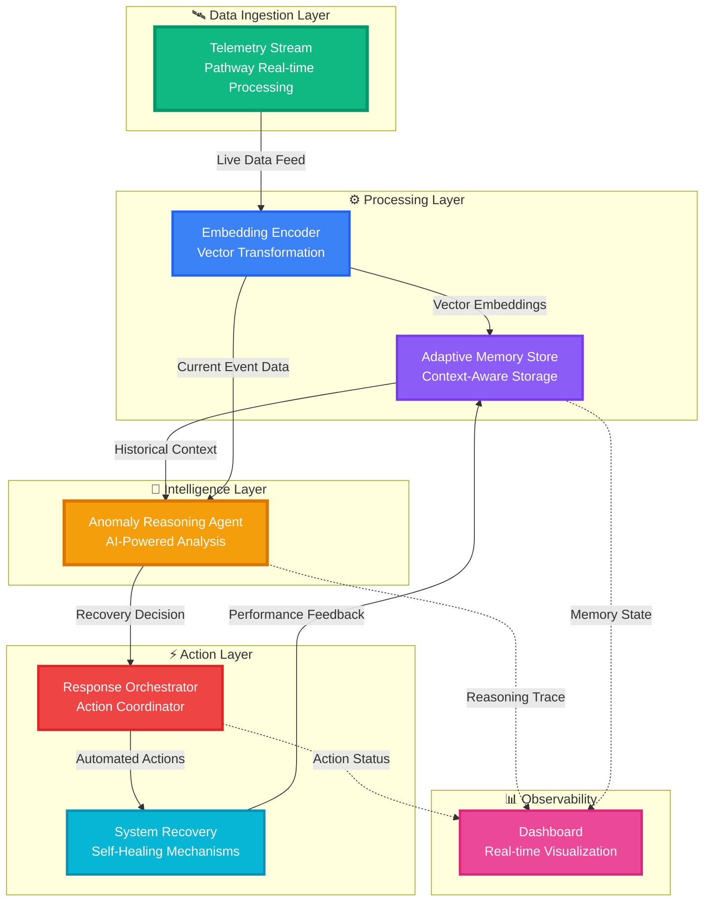

<div align="center">
  

  # AstraGuard AI
  
  ### AI-Powered Satellite Security & Anomaly Detection System
  
  **Apertre-3.0 Featured Project**

  [](https://code.elitecoders.xyz/profile/subhajitroy857+1)
  [](https://opensource.org/licenses/MIT)
  [](https://www.python.org/)
  [](https://reactjs.org/)
  [](https://nodejs.org/)
  [](https://fastapi.tiangolo.com/)

  ---
  
  [](https://chat.whatsapp.com/Ka6WKpDdKIxInvpLBO1nCB)
  

  <p align="center">
    <a href="docs/TECHNICAL.md"><strong>📚 Documentation</strong></a> •
    <a href="docs/TECHNICAL_REPORT.md"><strong>📄 Technical Report</strong></a> •
    <a href="src/research/"><strong>🧪 Research Lab</strong></a> •
    <a href="docs/changelogs/CHANGES.md"><strong>📝 Changelog</strong></a>
  </p>

  <p align="center">
    <a href=".github/ISSUE_TEMPLATE/bug_report.yml">🐛 Report Bug</a> •
    <a href=".github/ISSUE_TEMPLATE/feature_request.yml">✨ Request Feature</a> •
    <a href="https://chat.whatsapp.com/Ka6WKpDdKIxInvpLBO1nCB">💬 Join WhatsApp Group</a>
  </p>

  ---

  ### **Bridging the gap between theoretical security concepts and real-world workflows**

</div>

---

## 🌟 Hall of Fame

**🏆 A huge thank you to all the talented developers who have contributed to AstraGuard AI**

<a href="https://github.com/sr-857/AstraGuard-AI-Apertre-3.0/graphs/contributors">
  
</a>

## _Want to see your avatar here? [Make your first contribution today!](CONTRIBUTING.md)_


---

# 🚀 About the Project

## *What is AstraGuard AI?*

**AstraGuard AI** is an open-source, mission-critical security system designed specifically for **CubeSat and satellite operations**. It seamlessly combines **AI-assisted threat detection** with **practical offensive security tooling** to create a comprehensive defense platform for space systems.

At its core, AstraGuard AI is:

- **🛡️ A Security Platform**: Built to test applications against simulated threats in controlled environments
- **🧠 An AI Learning System**: Uses local LLMs (Llama 3/Mistral) to analyze attack surfaces and generate smart payloads
- **📊 A Monitoring Dashboard**: Provides real-time visualization of security posture and system health
- **🎓 A Training Ground**: Designed to help learners bridge the gap between theoretical knowledge and real-world security workflows

## *Why AstraGuard AI?*

Traditional security tools often fall into two categories:
1. **Theoretical frameworks** that are great for learning but disconnected from reality
2. **Production tools** that are powerful but have steep learning curves

**AstraGuard AI bridges this gap** by providing:

✅ **Real-World Context**: Security operations modeled after actual CubeSat mission phases  
✅ **Hands-On Learning**: Practical tools with educational guidance built-in  
✅ **Privacy-First AI**: 100% local processing—no data leaves your machine  
✅ **Production-Ready Code**: Clean, well-documented codebase suitable for real deployments  
✅ **Adaptive Intelligence**: Context-aware decisions based on mission phase and historical patterns  

### Target Audience

AstraGuard AI is designed for:

| Audience | What They'll Learn | How They'll Benefit |
|----------|-------------------|---------------------|
| **🎓 Students** | Security workflows, API design, ML integration | Hands-on experience with real security tools |
| **👨‍💻 Developers** | Offensive security, payload generation, threat modeling | Understanding of attack surfaces and defense strategies |
| **🛡️ Security Practitioners** | Automated threat detection, incident response | Practical tools for vulnerability assessment |
| **🚀 Space Enthusiasts** | CubeSat operations, telemetry analysis | Understanding of satellite security challenges |

---

## 🏗️ System Architecture

<div align="center">


</div>

### 📊 Architecture Overview

AstraGuard AI implements a sophisticated, event-driven architecture for real-time satellite telemetry monitoring and autonomous anomaly recovery. The system leverages vector embeddings, adaptive memory, and AI-powered reasoning to provide intelligent, self-healing capabilities.



### 🔧 Core Components

#### 🛰️ **Telemetry Stream (Pathway)**

**Purpose**: Real-time data ingestion and stream processing

**Key Features**:
- Continuous satellite telemetry monitoring
- High-throughput data streaming (1000+ events/sec)
- Protocol support: MQTT, WebSocket, gRPC
- Fault-tolerant message queuing

**Technologies**:
- Pathway for real-time streaming
- Apache Kafka for message brokering
- Protocol Buffers for serialization

```python
# Example: Telemetry ingestion
stream = pathway.io.kafka.read(
    topic="satellite-telemetry",
    schema=TelemetrySchema,
    autocommit_duration_ms=1000
)
```

#### 📊 **Embedding Encoder**

**Purpose**: Transform raw telemetry into semantic vector representations

**Key Features**:
- Multi-modal embedding (numerical, categorical, temporal)
- Dimensionality: 768-dimensional vectors
- Context-aware encoding with attention mechanisms
- Real-time transformation (<10ms latency)

**Technologies**:
- Sentence Transformers
- Custom trained embeddings on satellite data
- FAISS for vector indexing

```python
# Vector transformation
embeddings = encoder.encode(
    telemetry_data,
    normalize=True,
    batch_size=32
)

# Index for similarity search
index.add(embeddings)
```

### Dual-Engine Design

#### 1. 🛡️ Core Security Engine (The Muscle)

**Technology**: Python 3.9+  
**Purpose**: Executes concrete security operations

**Capabilities**:
- **Packet Manipulation**: Uses Scapy for deep packet inspection and crafting
- **Network Scanning**: Integrates with Nmap for port scanning and service detection
- **Payload Delivery**: Automated injection and testing of security payloads
- **Traffic Interception**: Proxy integration with Burp Suite for man-in-the-middle analysis
- **Protocol Analysis**: Deep inspection of network protocols and data streams

**Design Philosophy**:
- Stateless and robust
- Fail-safe by default
- Does exactly what it's told—no surprises
- Comprehensive logging for audit trails

#### 2. 🧠 AI Intelligence Layer (The Brain)

**Technology**: Python (LangChain/Ollama) + Node.js  
**Purpose**: Analyzes context and makes intelligent decisions

**Capabilities**:

**A. Attack Surface Analysis**
- Reads scan data from the Security Engine
- Identifies "interesting" targets based on service versions, port configurations, and legacy protocols
- Prioritizes targets by exploitability

**B. Smart Payload Generation**
- Crafts payloads specific to the target technology stack
- Adapts to application framework (Django, Flask, Express, etc.)
- Considers defense mechanisms detected during reconnaissance

**C. Risk Assessment**
- Scores vulnerabilities based on real-world exploitability
- Considers attack complexity, available exploits, and mission objectives

**D. Contextual Decision Making**
- Uses historical anomaly patterns from Adaptive Memory Store
- Adjusts responses based on mission phase
- Learns from previous incidents to improve detection

**Privacy Guarantee**:
- **100% Local Processing**: All AI models run via Ollama on your machine
- **No Cloud Calls**: Sensitive scan data never leaves your infrastructure
- **Offline Capable**: Works without internet connection
- **Audit Trail**: All AI decisions are logged with reasoning traces

### Data Flow

1. **Telemetry Ingestion**: Satellite telemetry streams into the system via Pathway
2. **Encoding**: Data is embedded into vector representations for semantic analysis
3. **Memory Storage**: Historical context is stored in the Adaptive Memory Store
4. **Anomaly Detection**: AI agent analyzes current data against historical patterns
5. **Policy Evaluation**: Mission phase policies determine appropriate response
6. **Action Orchestration**: Response orchestrator executes recovery actions
7. **Feedback Loop**: Action results feed back into memory for continuous learning
8. **Dashboard Update**: Real-time updates pushed to monitoring interface

---

## ✨ Key Features

### Core Capabilities

| Feature | Description | Technology |
|---------|-------------|------------|
| **🤖 AI Threat Assistant** | Local LLM-powered vulnerability analysis using Llama 3 or Mistral models | LangChain + Ollama |
| **🛡️ Offensive Tooling Suite** | Comprehensive payload generation, injection testing, and security scanning | Python + Scapy + Nmap |
| **📊 Smart Dashboard** | Real-time visualization of threats, system health, and security metrics | Streamlit + React |
| **🔬 Research Lab** | Integrated environment for testing security hypotheses and verifying findings | Python + Jupyter |
| **⚡ Real-Time Streaming** | High-performance telemetry processing with sub-second latency | Pathway |
| **🧠 Adaptive Memory** | Context-aware decision making based on historical anomaly patterns | Vector embeddings |
| **🎯 Smart Prioritization** | Intelligent target selection based on exploitability and mission impact | AI reasoning |
| **🔍 Explainable Anomaly Insights** | Per-anomaly explanations including feature importances, SHAP values, and confidence scores | React + visualization |
| **📈 Health Monitoring** | Component-level degradation tracking with automated failover | Centralized error handling |

### 🚀 Mission-Phase Aware Fault Response

AstraGuard AI understands that **CubeSat operations have different constraints at different stages**. The same anomaly might trigger different responses depending on the current mission phase.

#### Phase Definitions & Policies

```
┌─────────────────────────────────────────────────────────────┐
│                     MISSION PHASES                          │
├─────────────────────────────────────────────────────────────┤
│                                                             │
│  LAUNCH                                                     │
│  ├─ Duration: T-0 to orbit insertion                        │
│  ├─ Priority: System survival                               │
│  ├─ Constraint: Minimal actions to avoid destabilization    │
│  └─ Response: LOG_ONLY (no active interventions)            │
│                                                             │
│  DEPLOYMENT                                                 │
│  ├─ Duration: Orbit insertion to systems checkout           │
│  ├─ Priority: Safe deployment of components                 │
│  ├─ Constraint: Limited responses, avoid disruption         │
│  └─ Response: STABILIZE (conservative recovery)             │
│                                                             │
│  NOMINAL_OPS                                                │
│  ├─ Duration: Normal operational phase                      │
│  ├─ Priority: Performance optimization                      │
│  ├─ Constraint: None (full autonomy)                        │
│  └─ Response: FULL_RECOVERY (all actions available)         │
│                                                             │
│  PAYLOAD_OPS                                                │
│  ├─ Duration: Active science/mission operations             │
│  ├─ Priority: Science data collection                       │
│  ├─ Constraint: Careful with power/attitude changes         │
│  └─ Response: PAYLOAD_SAFE (mission-aware recovery)         │
│                                                             │
│  SAFE_MODE                                                  │
│  ├─ Duration: Critical failure or emergency                 │
│  ├─ Priority: System survival only                          │
│  ├─ Constraint: Minimal subsystem activation                │
│  └─ Response: SURVIVAL_ONLY (log + essential recovery)      │
│                                                             │
└─────────────────────────────────────────────────────────────┘
```

### 🛡️ Centralized Error Handling & Graceful Degradation

AstraGuard AI is designed to **never crash**. The system includes a comprehensive error handling layer that ensures resilience under all failure conditions.

#### Design Principles

1. **Fail Gracefully**: Component failures trigger fallback behavior instead of system crashes
2. **Centralized Handling**: All errors flow through a single error handling pipeline
3. **Structured Logging**: Errors include full context (component, phase, telemetry state)
4. **Health Tracking**: Real-time component health exposed to monitoring dashboard
5. **Smart Fallbacks**: Each component has a defined degraded operating mode

### 🌐 REST API for External Integration

AstraGuard AI provides a **production-ready FastAPI server** for programmatic access and integration with external systems.

#### API Features

✅ **Input Validation**: Pydantic models with comprehensive data validation  
✅ **OpenAPI Documentation**: Interactive Swagger UI at `/docs`  
✅ **CORS Support**: Ready for web frontend integration  
✅ **Batch Processing**: Submit 1-1000 telemetry points in a single request  
✅ **Rate Limiting**: Configurable limits to prevent abuse  
✅ **Authentication**: API key support for production deployments  
✅ **Versioning**: `/api/v1/` prefix for future compatibility  
✅ **100% Test Coverage**: 23/23 tests passing  

---

## 🎯 Project Goals (Apertre-3.0)

As part of **Elite Coders Winter of Code 2026**, AstraGuard AI has clear deliverables and learning objectives:

### Primary Objectives

- ✅ **Stable AI Security Module**: Build a production-ready AI assistant for intelligent vulnerability detection
- ✅ **Contributor-Friendly Issues**: Create 20+ well-scoped issues with learning notes
- ✅ **Comprehensive Documentation**: Improve onboarding and technical docs
- ✅ **Automated Testing**: Implement CI/CD pipelines
- ✅ **Production-Ready MVP**: Ship a fully working system

---

## 🛠️ Tech Stack

### Frontend

| Technology | Version | Purpose |
|------------|---------|---------|
| **React** | 18.2+ | UI framework |
| **TailwindCSS** | 3.4+ | Styling |
| **Vite** | 5.0+ | Build tool |
| **Recharts** | 2.10+ | Data visualization |

### Backend

| Technology | Version | Purpose |
|------------|---------|---------|
| **Node.js** | 16+ | JavaScript runtime |
| **FastAPI** | 0.104+ | Python API framework |
| **MongoDB** | 6.0+ | Database |
| **Pathway** | 0.7+ | Stream processing |

### Security Engine

| Technology | Version | Purpose |
|------------|---------|---------|
| **Python** | 3.9+ | Core language |
| **Scapy** | 2.5+ | Packet manipulation |
| **Nmap** | 7.94+ | Network scanning |

---

## 📂 Project Structure

```
AstraGuard-AI/
├── src/                # Core application source code
│   ├── security_engine/# Threat detection & payload generation
│   ├── ai_agent/       # LLM integration & reasoning
│   ├── api/            # FastAPI backend services
│   ├── core/           # System policies & error handling
│   └── research/       # Labs & Jupyter experiments
├── ui/                 # Unified user interface components
│   ├── dashboard/      # Streamlit/React dynamic dashboard
│   ├── frontend/       # Documentation & landing pages
│   └── assets/         # Unified static media (logos, images)
├── infra/              # Orchestration & Deployment
│   ├── docker/         # Container definitions
│   ├── k8s/            # Kubernetes manifests
│   └── monitoring/     # Prometheus/Grafana configs
├── docs/               # Technical documentation & guides
├── scripts/            # Automation & Maintenance
└── tests/              # Validation suites
```

---

## 🚀 Getting Started

### Prerequisites

| Software | Minimum Version | Purpose |
|----------|----------------|---------|
| **Python** | 3.9 | Core runtime |
| **Node.js** | 16.0 | Frontend & tooling |
| **Git** | 2.30 | Version control |
| **Docker** | 20.0 (optional) | Containerization |

### Installation Steps

#### Step 1: Clone the Repository

```bash
git clone https://github.com/sr-857/AstraGuard-AI.git
cd AstraGuard-AI
```

#### Step 2: Set Up Python Environment

```bash
# Create virtual environment
python -m venv venv

# Activate virtual environment
source venv/bin/activate  # Linux/macOS
venv\Scripts\activate     # Windows

# Install dependencies
pip install -r requirements.txt
```

#### Step 3: Install Node.js Dependencies

```bash
cd dashboard
npm install
cd ..
```

#### Step 4: Configure Environment

```bash
cp .env.example .env
# Edit .env with your configuration
```

#### Step 5: Start the Application

```bash
# Start API server
python cli.py api

# Start dashboard (in another terminal)
python cli.py dashboard
```

---

## 🌐 API Documentation

### Quick Start Example

```python
import requests

BASE_URL = "http://localhost:8000/api/v1"

# Submit telemetry
response = requests.post(f"{BASE_URL}/telemetry", json={
    "timestamp": "2026-01-04T12:00:00Z",
    "voltage": 7.2,
    "temperature": 35.5,
    "gyro": 0.08,
    "mission_phase": "NOMINAL_OPS"
})

result = response.json()
print(result)
```

---

## 👥 Contributing

We welcome contributions! See [CONTRIBUTING.md](CONTRIBUTING.md) for guidelines.

---

## 📚 Documentation

- [Getting Started](docs/GETTING_STARTED.md)
- [Technical Documentation](docs/TECHNICAL.md)
- [API Reference](docs/API_REFERENCE.md)
- [Architecture](docs/ARCHITECTURE.md)

---

## 📞 Community & Support

- **WhatsApp**: [Join Group](https://chat.whatsapp.com/Ka6WKpDdKIxInvpLBO1nCB)
- **GitHub Discussions**: [discussions](https://github.com/sr-857/AstraGuard-AI/discussions)
- **Issues**: [Report bugs](https://github.com/sr-857/AstraGuard-AI/issues)

---

## 📄 License

This project is licensed under the MIT License - see the [LICENSE](LICENSE) file for details.

---

<div align="center">
  
  ### 🌟 Star History
  
  [](https://star-history.com/#sr-857/AstraGuard-AI&Date)
  
  ---
  
  <sub>Part of <strong>Elite Coders Winter of Code '26</strong></sub><br>
  <sub>Made with ❤️ by the **AstraGuard AI Team**</sub>
  
  <br>
  
  <sub>© 2026 AstraGuard AI. All rights reserved.</sub>
  
</div>
